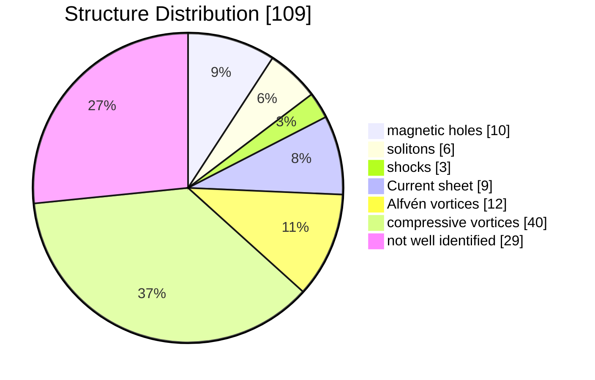
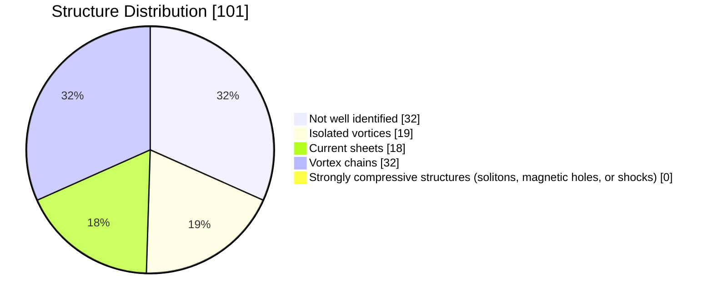

---
{"dg-publish":true,"permalink":"/_Documents/2 Coherent structures/","noteIcon":"default","created":"2026-06-18T16:07:01.236+08:00","updated":"2026-06-19T15:19:22.921+08:00","dg-note-properties":{}}
---


# 1 Compressive Coherent Structures at Ion Scales in The Slow Solar Wind (have read)   
Perrone, D., Alexandrova, O., Mangeney, A., Maksimovic, M., Lacombe, C., Rakoto, V., Kasper, J. C., & Jovanovic, D. (2016). Compressive coherent structures at ion scales in the slow solar 0wind. _The Astrophysical Journal_, 826(2), 196. [https://doi.org/10.3847/0004-637X/826/2/196](https://doi.org/10.3847/0004-637X/826/2/196)
## 1.1 主要内容  
### 1.1.1 简介
> [!摘要]
> $\quad$ 本研究旨在探究慢太阳风流中接近离子尺度的磁场波动，我们在此观测到了<font color="#ff0000">磁压缩</font>的显著增加。研究发现，这些压缩性波动的本质特征是相干结构。尽管先前的研究表明，电流片是离子尺度间歇性的主要成因，但我们的研究首次揭示，<font color="#ff0000">在慢太阳风环境下，多种多样的相干结构共同导致了质子尺度的间歇性，而电流片并非其中最普遍的类型。</font>  
> $\quad$ 具体来说，我们发现了具有压缩性 ($\delta b_\parallel \gg \delta b_\perp$) 和线性极化的结构，它们表现为<font color="#ff0000">磁洞、磁孤子和激波等</font>形式。此外，还识别出一些阿尔芬结构 ($\delta b_\perp \gg \delta b_\parallel$)，它们以<font color="#ff0000">电流片和类似涡旋的结构</font>存在。部分涡旋的 $\delta b_\parallel \gg \delta b_\perp$，类似于阿尔芬涡旋，但大多数结构的特征是 $\delta b_\perp \gtrsim \delta b_\parallel$。  
> $\quad$ 多亏了 Cluster 的多点测量数据，我们得以对大约 100 个结构进行分析，并确定了它们的法向、传播速度以及沿法向的空间尺度。值得注意的是，<font color="#ff0000">无论结构类型如何，其法向总是垂直于局部磁场</font>，这意味着 $k_\perp \gg k_\parallel$。我们发现，这些研究结构的空间尺度约为质子回旋半径的 2 到 8 倍。其中大部分结构仅随太阳风对流，但也有 25%的结构在等离子体参考系中独立传播。最后，我们讨论了对这些观测到的结构的可能解释，以及它们与等离子体加热之间的潜在联系。  
> 

电流片和阿尔芬涡旋是一种 $\delta b_{\perp}\gg \delta b_{||}$ 的相干结构，而磁孤子和磁洞是 $\delta b_{\perp} \ll \delta b_{||}$ 的强压缩结构。这些事件的特征尺度在 5 秒到数十秒之间（对应于 10 个到数十个质子惯性尺度的厚度）。  

通过对磁场扰动的小波变换滤波，发现，在所分析的时间区间内（约 2 小时内约 600 次持续数秒的事件），约 40%的时间段被不同性质的相干结构所覆盖。在这些结构中，研究观察到了线性极化的压缩事件，如磁洞、孤子或激波结构；还有线性极化的阿尔芬事件（即具有主导横向波动 $\delta b_{\perp}\gg \delta b_{||}$ 的事件），如电流片，以及椭圆极化的阿尔芬事件：其外观类似于磁涡旋。利用 Cluster 卫星系统，研究者能够根据这些结构法线的方向以及在等离子体坐标系中的传播情况，对其中的 109 个结构进行描述。  
### 1.1.2 基本数据和小波变换
> [!tip] Overview of solar wind data for the time interval 00:00-03:00 UT on 2002 February 19 th from Cluster
> 平均风速 $360 km/s$，平均磁场 $9nT$
>   
> From top to bottom: magnitude of V (a) and B (b), latitude (θ, purple dots) and azimuth (f, green dots) angles of B (c) and $θ_{BV}$ (d); proton (blue dots) and electron (red dots) density (e), temperature (f) and plasma beta (g). Characteristic lengths for protons $L_p$ (h) and electrons $L_e$ (i): Lamour radii $ρ_i=\frac{v^{th}_i}{\omega^{cyclotron}_i}$ (dark lines) and inertial range $λ_i=\frac{c}{\omega_{pi}}$ (light lines), with i = p, e. Logarithmic contour plots of LIM(Local Intermittency Measure), I(τ, t) (see text), for parallel (l) and perpendicular (m) magnetic field fluctuations. Vertical dashed lines denote the time interval 00:12–02:36 UT used in the present analysis.

对磁场做莫雷小波变换，$\tau$ 是选取的时间尺度：
$$
\mathcal{W}_{i}(\tau, t)=\sum_{m=0}^{N-1} B_{i}\left(t_{m}\right) \psi^{*}\left[\left(t_{m}-t\right) / \tau\right]
,\quad
i = x,y,z
$$
$$
\psi(u)=2^{1 / 2} \pi^{-1 / 4} \cos \left(\omega_{0} u\right) \exp \left(-u^{2} / 2\right),\quad 
\omega_0 = 6
$$
压缩波动可近似为磁场强度的变化所导致的，因此相应的能量为：  
$$
\mathcal{W}_{\|}^{2}(\tau, t)=\mathcal{W}_{|B|}^{2}(\tau, t) .
$$
波动的总能量写作
$$
\mathcal{W}_{B}^{2}(\tau, t)=\sum_{i} \mathcal{W}_{i}^{2}(\tau, t), \quad i=x, y, z,
$$
定义阿尔芬扰动的能量（垂直于平均磁场）：
$$
\mathcal{W}_{\perp}^{2}(\tau, t)=\mathcal{W}_{B}^{2}(\tau, t)-\mathcal{W}_{\|}^{2}(\tau, t) .
$$
归一化得到 LIM (Local Intermittency Measure，图 l, m)：
$$
I_{\|, \perp}(\tau, t)
=\frac{\left|\mathcal{W}_{\|, \perp}(\tau, t)\right|^{2}}
{\left\langle \left| \mathcal{W}_{\|, \perp}(\tau,t)\right|^{2}\right\rangle_{t}},
$$
观察到磁能在时间上的非均匀分布，伴随着覆盖一系列尺度的局部能量事件的出现：这是间歇性相干结构的固有特性。
### 1.1.3 间歇性事件的识别
在特定的尺度范围（本文为 $\tau \in [0.5, 10]s$）内，磁场的波动可以通过基于小波变换的带通滤波器来定义：  
$$
\delta b_{i}(t)=\frac{\delta j \delta t^{1 / 2}}{C_{\delta} \psi_{0}(0)} \sum_{j=j_{1}}^{j_{2}} \frac{\tilde{\mathcal{W}}_{i}\left(\tau_{j}, t\right)}{\tau_{j}^{1 / 2}}
,\quad
i = x,y,z,\perp,\| 
$$
此处 $j$ 是尺度 $\tau$ 的索引，$\delta j$ 是尺度的常数步长，$\psi_0(0)=\pi^{1/4},~ C_\delta =0.776$（可见[小波教程_en](/img/user/_Documents/docs/3%20Theory%20&%20tools%20&%20observation%20of%20Turbulence/3.2%20A%20Practical%20Guide%20to%20Wavelet%20Analysis.pdf)），采取 $\tau(j_1)=0.5s,~\tau(j_2)=10s$.  


上图(b)的非高斯分布尾部特征表明，湍流存在某种间歇性或不均匀性。图(c)的磁波动能量的包络线由蓝色实线表示，是包裹振荡信号极值的平滑曲线，垂直的红色实线表示高斯函数拟合结果的三个标准差的位置($\delta b_{\|}^2 = 3.9 \times 10^{-2} \text{nT}^2$)，这一范围包含了高斯函数贡献的 99.7%，所有超出此限值的事件都会贡献于 PDF 的非高斯部分。该数值将被用作筛选非高斯压缩间断事件的阈值。  

将某一事件的宽度 Δτ′ 定义为包络线中两个最小值之间的时间范围，该范围包含超过阈值的能量的最大值。事件的特征时间尺度 Δτ 可以定义为半峰值宽度（即图中黑色虚线的交点）。在所研究的整个时间范围内，共记录到约 <font color="#ff0000">600</font> 个事件（$\Delta \tau \in [0.25, 7]~ \text s,~\Delta \tau' \in [0.75, 7.5]~ \text s$ 。对这些事件进行最小方差分析，可以识别出 <font color="#ff0000">6</font> 个 families。

包括：  


| Strongly Compressive Structures (the maximal variation is $\delta b_z$, evaluated by $\xi_{\parallel}= \sqrt{\frac{{\max(\delta b_z^2)}}{max(\delta b_x^2 +\delta b_y^2)}}$)                                                                                                                                                                                                                                                                                                     | Alfvénic Structures ($\delta b_{\perp}>\delta b_{\parallel}$)                                                                                                                                                                                                                                                                                                                                                                                                                                                                                                                                                                                                                      |
| -------------------------------------------------------------------------------------------------------------------------------------------------------------------------------------------------------------------------------------------------------------------------------------------------------------------------------------------------------------------------------------------------------------------------------------------------------------------------------- | ---------------------------------------------------------------------------------------------------------------------------------------------------------------------------------------------------------------------------------------------------------------------------------------------------------------------------------------------------------------------------------------------------------------------------------------------------------------------------------------------------------------------------------------------------------------------------------------------------------------------------------------------------------------------------------- |
| <font color="#ff0000">Soliton </font> ：the ion temperature is almost isotropic ($T_\perp / T_{\parallel} \approx 1.1$, $C_M<1$)  <br>$\xi_{\parallel}=1.6$ <br><br>                                                                                                                                                                                                                                                                | <font color="#ff0000">Current sheet </font> ：$T_\perp / T_{\parallel} \approx 0.6$<br>                                                                                                                                                                                                                                                                                                                                                                                                                                                                                                                                               |
| <font color="#ff0000">magnetic hole  </font> ：  <br>high values of temperature anisotropy ($T_\perp / T_{\|} \approx 2$， $C_M>1$) and plasma beta. "mirror mode structures". near-zero spreading speed.  <br><br><font color="#00b0f0"><center>chain</center></font>$\xi_{\parallel}=2.1$   <br><br><font color="#00b0f0"><center>solitary</center></font>$\xi_{\parallel}=1.8$ <br> | <font color="#ff0000">Vortex</font> ：characterized by a local increase of the background magnetic field, $\nabla_{\perp}\gg \nabla_{\parallel}(k_\perp \gg k_{\parallel})$. isotropic.  <br><br><center><font color="#00b0f0">solitary Alfvén vortex</font><br>(similar to what is observed for dipolar Alfvén vortices in the Earth’s magnetosheath (Alexandrova et al. 2006) and compatible with a cylindrical structure)</center>$\xi_{\parallel}=0.16$   <br><br>  <br><center><font color="#00b0f0">Alfvén vortex-like</font></center>$\xi_{\parallel}=0.33$   <br><br>  <br><br> |
| <font color="#ff0000">shock</font>: $T_\perp / T_{\parallel} \approx 2.1$, Mach number > 1(compatible with the fast magnetosonic shock wave), $\beta > 1$<br>  <br>$\xi_{\parallel}=0.95$ <br>                                                                                                                                                                                                                                     | <font color="red">compressive vortex-like</font>： $\xi_{\parallel} \in [0.35, 1.1]$  <br> <br> $\xi_{\parallel} \approx 0.5$   <br>they can propagate in the flow or can be convected by the wind.                                                                                                                                                                                                                                                                                                                                                                                                                                   |
| A careful inspection of the 600 structures shows that   usually magnetic holes appear in the plasma as a <span style="background:#fff88f">chain</span> of compressive structures, while solitons are observed as isolated structures.                                                                                                                                                                                                                                            |                                                                                                                                                                                                                                                                                                                                                                                                                                                                                                                                                                                                                                                                                    |

在上图的图(b)中，$x,y,z$ 方向与 GSE 坐标不同。定义 $\Delta\tau'$（黑色虚线）范围内的局部平均磁场 $\boldsymbol{b_0}$，以及局部平均流速 $\boldsymbol{v_0}$，则 $\boldsymbol{e_z} = \boldsymbol{\hat b_0}$，$\boldsymbol {{e_x}} = (\boldsymbol{\hat b_0} \times \boldsymbol{\hat{v_0}}) \times \boldsymbol{\hat b_0}$ 为 $\boldsymbol{\hat{v_0}}$ 垂直 $\boldsymbol{e_z}$ 的部分，$\boldsymbol{e_y}$ 满足右手系定义。  

电流密度通过 curlometer technique (Dunlop et al. 1988, 2002) 计算得到，对于 solitons、holes 和 shock，$\boldsymbol{J}$ 接近垂直于局地磁场 $\boldsymbol{b_0}$，尤其是 solitons，几乎完全垂直。而对于 sheet、Vortex 和 compressive vortex-like structures，则几乎是 $\boldsymbol{J} \parallel  \boldsymbol{b_0}$。  

绝大多数观测到的结构是 compressive vortex-like structures，基本满足 $\delta \boldsymbol b_{max} \perp \boldsymbol{b_0},\ \delta \boldsymbol b_{intermediate} \parallel \boldsymbol{b_0}$，因此有稍强的压缩 $\xi_{\parallel} \approx 0.5$，

这些结构的法向 $\boldsymbol{n}$ 由 timing method (section 4.2.1) 得到，magnetic holes 严格成立 $\boldsymbol{n} \perp \boldsymbol{b_0}$，其他结构也基本满足垂直的关系，意味着 $k_\perp \gg k_\parallel$。  

文章指出其他几个注意点：  
> The normal to the structures was determined assuming that the structure is locally planar. However, this front seems to be perturbed or finite, especially in case of the magnetic holes (one can see that the different satellites observe different amplitudes). Such variation in amplitude cannot be explained by an infinite plane (in that case, all satellites would see the same amplitude in each point of the plane). Therefore, <span style="background:#fff88f">the structure is not perfectly planar</span>.  
> 
> Almost all the magnetic holes are observed under <span style="background:#fff88f">mirror unstable plasma</span> conditions (mirror parameter $C_M=\left(\frac{\beta_{\perp}}{\beta_{\|}}-1\right)\left(\beta_{\perp}+1\right)>1,\ \beta_{\perp,\|}=\frac{2 \mu_{0} P_{\perp,\|}}{B^{2}}$)  
> 
> In most cases, <span style="background:#fff88f">the propagation velocities for the solitons are different from zero</span> and are of the order of the velocity of the fast mode and/or proton thermal speed. Therefore, the observed magnetic solitons cannot be explained by the mirror instability. （Their (Sloitons') existence as traveling waves means they are sustained by a balance between the medium's non-linear effects (which cause waveform steepening) and its dispersive effects (which cause spreading). On the contrast, Even though the nonlinear evolution of the mirror instability can lead to stable structures like magnetic holes, the classical or linear mirror mode itself is defined by its near-zero phase speed.）

在 109 个结构子集中，每种结构的占比如下：

因为与相邻的已确定的间歇性事件的相互作用，$27\%$ 的结构无法确定。

### 1.1.4 统计分析  
#### 最小方差分析（600 事件）  
计算了每个结构(范围 $\Delta \tau'$)的协方差矩阵，确定 max, int, min 三个特征值的比值和特征值方向(与局地磁场的夹角)的分布。表明 $\theta_max>65^\circ$ 居多，即大部分是 Alfvén 结构。  
#### Timing Method 确定结构法向 
使用 timing method [Schwartz, 1998] 和四颗卫星确定结构的法向 $\vec{n}$ 和法向速度 $\mathcal{V}$：  
$$
\vec{D_{ij}} \cdot {\vec{n}} = \mathcal{V}\Delta t_{ij} ,\quad  i,j \in \{1,2,3,4\}; ~i\neq j
$$
其中 $\vec{D_{ij}} = \vec{D_j} - \vec{D_i}$ 是两颗卫星之间的位矢，$\Delta t_{ij} = t_j  - t_i$ 是卫星测量时间间隔，$|D|\approx 0.1 \text{km}$，而 $\Delta t_{ij}$ 由互相关函数(the cross-correlation function)的最大值计算确定：  
$$
\max\mathcal{R}_{i j}(\Delta t)=\frac{\left\langle\delta \boldsymbol{B}_{i}(t) \cdot \delta \boldsymbol{B}_{j}(t+\Delta t)\right\rangle}{\sqrt{\langle\delta B_{i}^{2}\rangle\langle\delta B_{j}^{2}\rangle}} 
$$
$\Delta t_{ij}$ 的误差根据 $R_{i j}(\Delta t)$ 的 Taylor 展开得到：  
$$
d \Delta t_{i j}=\sqrt{\frac{2}{\mathcal{R}_{i j}^{\prime \prime}\left(\Delta t_{i j}\right)} \frac{\Delta B}{B}}
$$
${R}_{i j}^{\prime \prime}$ 表示二阶导数。结果需满足 $\Delta t_{i j}=\Delta t_{i k}+\Delta t_{k j}, \quad \Delta t_{i j}=-\Delta t_{j i}$ (已假设事件为局部平面结构且匀速传播)，否则卫星观测到的可能不是同一事件。约定 $\vec{D_{ij}} \cdot \frac{\vec{n}}{\mathcal{V}} = \Delta t_{ij}$ 给出的斜率 $\mathcal{V}$ 不会偏差过大。最终从 600 事件中选得满足条件的事件 <font color="#ff0000">109 </font>个，这些结构能够较为准确的得到 $\vec{ n}$ 和 $\mathcal{V}$。  

对该子集的统计分析表明，$\theta_{nB}$ ～ $90^\circ$，即所有相干结构都有波矢各向异性 $k_\perp \gg k_\parallel$。定义两个空间尺度：  
$$
\Delta r=\mathcal{V} \Delta \tau \quad \text { and } \quad \Delta r^{\prime}=\mathcal{V} \Delta \tau^{\prime}
$$
并计算其和质子拉莫半径 $\rho_p$ 比值的分布，  

#### 在 Plasma Frame 下的速度  
可以计算结构在等离子体参考系中的速度和误差：  
$$
\mathcal{V}_0 = \mathcal{V} - \vec{v}_{sw} \cdot \vec{n}, \quad d \mathcal{V}_{0}=d \mathcal{V}+d v_{\mathrm{sw}} \cos \theta_{n V}+v_{\mathrm{sw}} \sin \theta_{n V} d \theta_{n V}
$$
$\vec v_{sw}$ 是 solar wind 的局地平均速度。
  
可见大部分结构(约 $75\%$)是随着太阳风对流的。右图中，三个用于归一化的分母是：the upstream speed for the fast modes $V_F$ (black histogram), for the Alfvén $V_A$ (red dashed line), and the proton thermal speed $V_{th}$ (blue dash-dot line). 
### 1.1.5 Conclusions  


## 1.2 链接  
[Perrone et al_2016_COMPRESSIVE COHERENT STRUCTURES AT ION SCALES IN THE SLOW SOLAR WIND](/img/user/_Documents/docs/2%20Coherent%20structures/2.1%20Perrone%20et%20al_2016_COMPRESSIVE%20COHERENT%20STRUCTURES%20AT%20ION%20SCALES%20IN%20THE%20SLOW%20SOLAR%20WIND.pdf)
## 1.3 补充
文章阅读中遇到的生词以及**一些关键概念**在在: [[_Documents/words/part.2 words#1 Coherent Structures at Ion Scales in Fast Solar Wind - Cluster Observations\|part.2 words]]


# 2 Coherent Structures at Ion Scales in Fast Solar Wind: Cluster Observations (partially)  
```bib
@article{Perrone2017,
doi = {10.3847/1538-4357/aa9022},
url = {https://doi.org/10.3847/1538-4357/aa9022},
year = {2017},
month = {oct},
publisher = {The American Astronomical Society},
volume = {849},
number = {1},
pages = {49},
author = {Perrone, D. and Alexandrova, O. and Roberts, O.~`W. and Lion, S. and Lacombe, C. and Walsh, A. and Maksimovic, M. and Zouganelis, I.},
title = {Coherent Structures at Ion Scales in Fast Solar Wind: Cluster Observations},
journal = {The Astrophysical Journal}
}
```

Perrone, D., Alexandrava, O., Roberts, O. W., Lion, S., Lacombe, C., Walsh, A., Maksimovic, M., & Zouganelis, I. (2017). Coherent structures at ion scales in fast solar wind: Cluster observations. _The Astrophysical Journal_ , 849(1), 49. https://doi.org/10.3847/1538-4357/aa9022
## 2.1 主要内容  
> [!info] 摘要
> We investigate the nature of magnetic turbulent fluctuations, around ion characteristic scales, in a fast solar wind stream, by using Cluster data. Contrarily to slow solar wind, where both Alfvénic ($\delta b_\perp > \delta b_\parallel$) and compressive ($\delta b_\parallel> \delta b_\perp$) coherent structures are observed, the turbulent cascade of fast solar wind is dominated by Alfvénic structures, namely, Alfvén vortices, with a small and/or finite compressive part, with the presence also of several current sheets aligned with the local magnetic field. Several examples of vortex chains are also recognized. Although an increase of magnetic compressibility around ion scales is observed also for fast solar wind, no strongly compressive structures are found, meaning that the nature of the slow and fast winds is intrinsically different. Multi-spacecraft analysis applied to this interval of fast wind indicates that the coherent structures are almost convected by the flow and aligned with the local magnetic field, i.e., their normal is perpendicular to B , which is consistent with a two-dimensional turbulence picture. Understanding intermittency and the related generation of coherent structures could provide a key insight into the nonlinear energy transfer and dissipation processes in magnetized and collisionless plasma.  
> 

- the parallel and perpendicular magnetic energy  
$$
I_{\|, \perp}(\tau, t)=\frac{\left|\mathcal{W}_{\|, \perp}(\tau, t)\right|^{2}}{\left\langle \left| \mathcal{W}_{\|, \perp}(\tau, t)\right|^{2}\right\rangle_{t}}
$$
- the phase coupling between the i-th & j-th magnetic components
$$
R_{i j}^{2}(\tau, t)=\frac{\left|\mathcal{S}\left(\tau \mathcal{W}_{i}(\tau, t) \mathcal{W}_{j}^{*}(\tau, t)\right)\right|^{2}}{\mathcal{S}\left(\tau\left|\mathcal{W}_{i}(\tau, t)\right|^{2}\right) \cdot \mathcal{S}\left(\tau\left|\mathcal{W}_{j}^{*}(\tau, t)\right|^{2}\right)}
,\quad i,j = x,y,z,\parallel,\perp,tot
$$
the values of $R_{ij} (\tau, t )$ are between 0 (no coherence) and 1 (full coherence)
- the flatness (or kurtosis) of $\boldsymbol{B}_i$
$$
\mathcal{F}_{i}(\tau)=\frac{\left\langle\tilde{\mathcal{W}}_{i}(\tau, t)^{4}\right\rangle}{\left\langle\tilde{\mathcal{W}}_{i}(\tau, t)^{2}\right\rangle^{2}}
$$
if $\mathcal{F}_{i}(\tau)>3$, the PDF is not a Gaussian distribution, showing fat tails.
- since the automatic method for the selection of intermittent events recovers the most energetic peaks, it is possible that if there are few of them very close they refer to <font color="#ff0000">the same event</font>.
### 2.1.1 间歇性事件的识别



| Structrue         | diagram                                        | remark                                                                                                                                                                                                                                                                                                                                                                                                                                                                                                                                                                                                                                                                                                                                                                                                                                                                       |
| ----------------- | ---------------------------------------------- | ---------------------------------------------------------------------------------------------------------------------------------------------------------------------------------------------------------------------------------------------------------------------------------------------------------------------------------------------------------------------------------------------------------------------------------------------------------------------------------------------------------------------------------------------------------------------------------------------------------------------------------------------------------------------------------------------------------------------------------------------------------------------------------------------------------------------------------------------------------------------------- |
| Current sheets    |  | In the panels (e) and (f),<br>the arrows display the directions of the normal of the structures,  <br> $\boldsymbol{n}$ (black), determined by using the timing method,   <br>of $\boldsymbol{v_0}$ (red), and of $\boldsymbol{b_0}$ (blue)  <br><br>  <br>$\delta b_y$ changes sign and is perpendicular to the local magnetic field.   <br>The other two components have fluctuations of very small amplitude.   <br>The reversal of the component of maximum   <br>variation is in the middle of the structure, where the large-<br>scale magnetic field has its local minimum (panel (a)) and a<br>peak in the current is recovered (panel (c)).  <br> in the center of the structure, a peak in the density is<br>found (panel (d)), meaning that the plasma is confined inside<br>the structure.<br><br>      <br>MVA(minimum variance analysis) $\to$ planar geometry |
| Isolated vortices |  | a modulated fluctuation;  <br>a local maximum in the middle of the structure;<br>the current density $\boldsymbol{J}$ is mainly in the direction parallel to $\boldsymbol{b_0}$;  <br>the electron density $n_e$ exhibits a fluctuating behavior<br>and is anti-correlated with $\boldsymbol{B}$, <br>with a local minimum in the center of the structure $\to$  pressure balance. <br><br>  <br>MVA $\to$ the intermediate component is not negligible,   <br>i.e., the event is a bi-dimensional structure.  <br><br><br>Quasi-mono-polar Alfvén vortex model <br>compared with the observation:   <br><br>                                                                                                                                                                                                                  |
| Vortex chain      |  | the electron density is anti-correlated  to   <br>the large-scale magnetic field, meaning that   <br>this event is also in pressure balance.                                                                                                                                                                                                                                                                                                                                                                                                                                                                                                                                                                                                                                                                                                                                 |


## 2.2 链接
本地 [2.3 Perrone et al_2017_Coherent Structures at Ion Scales in Fast Solar Wind](/img/user/_Documents/docs/2%20Coherent%20structures/2.2%20Perrone%20et%20al_2017_Coherent%20Structures%20at%20Ion%20Scales%20in%20Fast%20Solar%20Wind.pdf)
## 2.3 补充
[[_Documents/words/part.2 words#2 Compressive Coherent Structures at Ion Scales in The Slow Solar Wind\|part.2 words]]
# 3 Magnetospheric multiscale observation of kinetic signatures in the Alfvén vortex  
Wang, T., Alexandrova, O., Perrone, D., Dunlop, M., Dong, X., Bingham, R., Khotyaintsev, Y. V., Russell, C. T., Giles, B. L., Torbert, R. B., Ergun, R. E., & Burch, J. L. (2019). Magnetospheric multiscale observation of kinetic signatures in the Alfvén vortex. _The Astrophysical Journal Letters,871_(2), L 22. [https://doi.org/10.3847/2041-8213/aafe0d](https://doi.org/10.3847/2041-8213/aafe0d)  

[2.3 Magnetospheric Multiscale Observation of Kinetic Signatures in the Alfvén Vortex](/img/user/_Documents/docs/2%20Coherent%20structures/2.3%20Magnetospheric%20Multiscale%20Observation%20of%20Kinetic%20Signatures%20in%20the%20Alfv%C3%A9n%20Vortex.pdf)
# 4 Soliton approach to magnetic holes
Baumgärtel, K. (1999), Soliton approach to magnetic holes, _J. Geophys. Res._, 104(A12), 28295–28308, doi:[10.1029/1999JA900393](https://doi.org/10.1029/1999JA900393 "Link to external resource: 10.1029/1999JA900393").
# 5 Magnetic Holes in the Solar Wind
Turner, J. M., Burlaga, L. F., Ness, N. F., & Lemaire, J. F. (1977). Magnetic holes in the solar wind. _Journal of Geophysical Research_, 82(13), 1921–1924. doi:[10.1029/JA082i013p01921](https://doi.org/10.1029/JA082i013p01921)
## 5.1 主要内容
> [!摘要]
> 本文基于 Explorer 43 (Imp I) 在 1 AU 附近的高时间分辨率磁场观测，发现太阳风中极低磁场强度区域（作者定义为 $|B|<1\gamma$，$1\gamma$ 等于 $1\ \mathrm{nT}$，对比太阳风典型磁场强度 $5\gamma$）通常不是随机低场扰动，而是嵌入在接近平均磁场背景中的离散 magnetic holes。28 个事件在约 18 天内出现，对应发生率约 $1.5\ \mathrm{day^{-1}}$。多数 magnetic holes 同时具有 $|B|$ 凹陷和磁场方向改变，其中一部分可能与 magnetic merging 有关；但也存在几乎没有磁场方向改变的 linear magnetic holes，这类事件不能由 merging 解释，可能是局地等离子体不均匀导致的抗磁效应。
### 5.1.1 数据、定义与基本统计
| 项目             | 本文采用/得到的值                                                              | 备注                                                                                                                                 |
| -------------- | ---------------------------------------------------------------------- | ---------------------------------------------------------------------------------------------------------------------------------- |
| 探测器            | Explorer 43 (IMP 1)                                                    | 1 AU 附近太阳风观测                                                                                                                       |
| 磁场仪            | GSFC magnetometer                                                      | 采样率 $12.5\ \mathrm{s^{-1}}$，可分辨每个 hole 的磁场结构                                                                                       |
| 等离子体仪          | GSFC plasma analyzer                                                   | 约 $1\ \mathrm{min}$ 得到一个谱，连续谱间隔约 $4\ \mathrm{min}$；无法分辨 hole 内部粒子结构，只能给出事件前后状态                                                     |
| 分析时段           | 1971-03-18 到 1971-04 初，约 18 天                                          | PDF 摘要写 March 18--April 6                                                                                                          |
| low field 判据   | $B<1\gamma$                                                            | 其中 $1\gamma\approx1\ \mathrm{nT}$；作为比较，平均 $B\approx6\gamma$，最可能值约 $5\gamma$                                                        |
| 事件数            | 28 个 magnetic holes                                                    | 先从 15 s 平均磁场图中识别，再用高采样磁场(12.5/s)检查结构                                                                                               |
| 发生率            | $1.5\ \mathrm{day^{-1}}$                                               | 约 $40$ 个 / solar rotation；介于 shocks ($\sim0.05\ \mathrm{day^{-1}}$) 与 directional discontinuities ($\sim25\ \mathrm{day^{-1}}$) 之间 |
| 持续时间           | $2\sim130\ \mathrm{s}$，中位数 $50\ \mathrm{s}$                            | 由单星穿越时间给出                                                                                                                          |
| 尺度估计           | $\sim2\times10^4\ \mathrm{km}$                                         | 假设以 $\sim400\ \mathrm{km\ s^{-1}}$ 随太阳风对流经过探测器                                                                                     |
| 相对质子 Larmor 半径 | 径向厚度约 $200R_L$ ($R_L$ 就是质子拉莫半径，也就是回旋半径)；若 field-aligned，实际厚度约 $150R_L$ | 文中取 hole 附近 $R_L\sim100\ \mathrm{km}$                                                                                              |
> <font color="#ff0000">Directional discontinuities</font>：在很短时间/空间尺度内，磁场矢量方向突然改变，但磁场强度不一定明显改变。如切向间断，阿尔芬间断和如今所说的电流片。

作者强调这些 low-$|B|$ 区域是比较孤立的磁场强度凹陷，而不是低场、扰动区域中的随机起伏。因此，太阳风中最低的磁场强度和最高磁场强度一样，可能来自某类特殊物理过程，而不只是普通背景涨落的尾部。
### 5.1.2 按磁场方向变化分类
| 类型                                                     |  数量 | 主要观测特征                                                              | 可能解释                                                                      |
| ------------------------------------------------------ | --: | ------------------------------------------------------------------- | ------------------------------------------------------------------------- |
| little/no directional change                           |   8 | $B$ 显著下降，但磁场方向几乎不变；其中 4 个是平滑、近对称的 linear holes，另 4 个强度变化较不规则        | 不能由 magnetic merging 解释；可能是局地 plasma inhomogeneity 的 diamagnetic response |
| D-sheet-like holes  <br>(常类似 tangential discontinuity) |   9 | $B$ 凹陷同时伴随磁场方向在一个平面内旋转，类似 directional discontinuity / current sheet | 部分事件可能与 magnetic merging / Sweet's mechanism 有关                           |
| 其他                                                     |  11 | 磁场方向变化不规则，不能清楚归入上述两类                                                | 机制不确定                                                                     |
高分辨率事件图使用的是逐事件定义的局地坐标系：y 方向沿事件前约 2 s 的平均磁场，z 方向由过渡区最小方差方向给出，x 方向补成右手系。若在此坐标系中 $B_z\approx0$，将其视为 tangential discontinuity 的特征。
#### 5.1.3 Magnetic merging：D-sheet-like holes  

|  |  |
| ----------------------------------------------------------------------------------------------------------------------------------------------------------------------------------------------------------------------------------- | ----------------------------------------------------------------------------------------------------------------------------------------------------------------------------------------------------------------------------------- |
如图 (Fig.3) 的 March 27 0440 UT 事件中，磁场方向旋转约 $180^\circ$，且磁场强度几乎降到零；$B_z\approx0$ 表明其类似 tangential discontinuity，might be the site of magnetic merging。该事件宽度约 $8\ \mathrm{s}$，与太阳风中的 directional discontinuity 典型宽度相近。若用 magnetic annihilation / Sweet's mechanism 估计，预测 $B_{min}\approx0.15\gamma$，观测值约 $0.12\gamma$，两者很接近。

| Event date and time (UT) | $\omega$ (deg): hole 两侧磁场方向之间的夹角 | $B_{min}^{pred}/B_{min}^{obs}$ | thickness ($R_L$) | 解释                                                                                                                                                                                                    |
| ------------------------ | -------------------------------: | -----------------------------: | ----------------: | ----------------------------------------------------------------------------------------------------------------------------------------------------------------------------------------------------- |
| March 27, 0440           |                              180 |                            1.2 |                 — | 预测与理论很接近；但几何方向不利，无法检验流向 current sheet 的 sub-Alfvénic streaming                                                                                                                                        |
| March 28, 1637           |                              129 |                            1.2 |                20 | 观测提示 $V_0/V_A\approx0.04$，where $V_0$ is the flow speed normal to the current sheet and $V_A$ is the Alfven speed outside and adjacent to the currentshee与向 current sheet 的 sub-Alfvénic streaming 一致 |
| April 6, 1638            |                              167 |                            2.7 |                14 | 观测 $B_{min}$ 明显低于 merging model 预测，说明还可能存在其他过程                                                                                                                                                        |
| April 1, 1025            |                              131 |                            7.1 |                 4 | 与 Fig. 4 对应；薄 D sheet-like 结构，但观测最小磁场远低于 merging 预测                                                                                                                                                   |
这里需要注意：这些 holes 与 Burlaga 早期讨论的 D-sheets 不完全相同。本文中的 magnetic holes 里，$|B|$ 凹陷的空间范围大致与磁场方向变化范围相当；而传统 D sheets 中，$|B|$ 凹陷通常比方向变化层宽得多。另外，本文的 holes 发生更频繁。
#### 5.1.3 Linear holes

Fig. 5 展示了一个典型 linear magnetic hole：磁场强度出现平滑、近对称的凹陷，但磁场方向几乎不变。图中变化主要出现在沿平均磁场方向的分量和 $|B|$ 上，因此该类事件不可能由 magnetic merging 直接产生，因为 merging 的必要观测特征之一是磁场方向改变。

| Event date and time (UT) | $n_1/n_2$ | $T_1/T_2$ | $V_1/V_2$ | $\beta_1$ | $\beta_2$ | $\omega$ (deg) |
| --- | ---: | ---: | ---: | ---: | ---: | ---: |
| March 23, 0552 | 0.92 | 0.86 | 1.01 | 3.80 | 2.02 | 6 |
| March 24, 1607 | 1.15 | 0.90 | 1.03 | 1.38 | 1.18 | 17 |
| March 24, 1633 | 1.03 | 1.02 | 1.02 | 1.11 | 1.02 | 5 |
| March 27, 1823 | 1.11 | 1.09 | 0.97 | 0.40 | 0.24 | 13 |

表中下标 1 和 2 分别表示事件前、事件后的等离子体测量。由于等离子体仪时间分辨率太低，这些值不能代表 hole 内部结构，只能说明 linear holes 前后可能存在等离子体参数变化；样本数也太少，作者没有给出强结论。

#### 5.1.4 可能的抗磁边界层解释
作者提出的一个可能解释是：linear magnetic holes 是局地等离子体不均匀引起的抗磁响应。文中使用的等离子体 beta 定义为
$$
\beta=\frac{n k T}{B^2/8\pi},
$$
其中 $n,T$ 分别为质子密度和温度。若某局地区域更热和/或更稠密，它可能“排斥”磁场，形成 $|B|$ 凹陷。

可以把一个 linear hole 理解为两个相邻的 diamagnetic boundary layers：  

| 区域 | 磁场强度变化 | 物理图像 |
| --- | --- | --- |
| 第一层 | 从背景值下降到 $B_{min}$ | 进入局地高等离子体压力区域，磁场被部分排出 |
| 第二层 | 从 $B_{min}$ 恢复到背景值 | 离开该等离子体不均匀区域 |
| 维持电流 | 由沿边界法向的电场漂移和 $\nabla B$ 相关漂移提供 | 形成维持该磁场凹陷的电流结构 |
该模型也允许出现 magnetic enhancement：如果局地等离子体压力降低，则磁场可能增强。Fig. 6 就是作者称作 magnetic hole “antithesis”的例子，即磁场强度在约 $7\ \mathrm{s}$ 内增强而方向基本不变。


### 5.1.3 结论与局限
| 结论                          | 说明                                                                                       |
| --------------------------- | ---------------------------------------------------------------------------------------- |
| magnetic holes 是离散结构        | 太阳风中最低 $B$ 往往以孤立 holes 形式出现，而非普通背景波动的随机低值                                                |
| 尺度较小                        | 典型穿越时间为几十秒，径向尺度约 $2\times10^4\ \mathrm{km}$，在作者采用的 Burlaga 分类中属于 kinetic-scale phenomena |
| 多数伴随方向改变                    | 这类 holes 类似 current sheet / directional discontinuity，一部分可能与 magnetic merging 有关         |
| linear holes 不能由 merging 解释 | 因为它们几乎没有磁场方向改变；可能与局地 plasma inhomogeneity 的抗磁效应有关                                        |
| 机制仍不确定                      | 粒子数据时间分辨率不足，无法观测 hole 内部等离子体不均匀；作者明确指出需要高分辨率粒子测量和多点观测来确定空间结构与演化                          |
## 5.2 链接
- 本地 PDF：[2.5 Turner et al. 1977 - Magnetic holes in the solar wind](/img/user/_Documents/docs/2%20Coherent%20structures/2.5%20Journal%20of%20Geophysical%20Research%20%201896-1977%20-%201%20May%201977%20-%20Turner%20-%20Magnetic%20holes%20in%20the%20solar%20wind.pdf)
- MinerU 输出：[[_Documents/docs/mineru_output/2.5 Journal of Geophysical Research  1896-1977 - 1 May 1977 - Turner - Magnetic holes in the solar wind/2.5 Journal of Geophysical Research  1896-1977 - 1 May 1977 - Turner - Magnetic holes in the solar wind\|MinerU markdown]]
# 6 Small-scale solitary wave pulses observed by the Ulysses magnetic field experiment
Rees, A., A. Balogh, and T. S. Horbury (2006), Small-scale solitary wave pulses observed by the Ulysses magnetic field experiment, _J. Geophys. Res._, 111, A10106, doi:[10.1029/2005JA011555](https://doi.org/10.1029/2005JA011555 "Link to external resource: 10.1029/2005JA011555").
# 7 Properties of magnetosheath mirror modes observed by Cluster and their response to changes in plasma parameters
Soucek, J., E. Lucek, and I. Dandouras (2008), Properties of magnetosheath mirror modes observed by Cluster and their response to changes in plasma parameters, _J. Geophys. Res._, 113, A 04203, doi:[10.1029/2007JA012649](https://doi.org/10.1029/2007JA012649 "Link to external resource: 10.1029/2007 JA 012649").  

# 8 Fluid theory of coherent magnetic vortices in high-space plasmas  
Jovanović, D.,  O. Alexandrova, M. Maksimović, and M. Belić,  (2020). Fluid theory of coherent magnetic vortices in high-β. _space plasmas_. arXiv. [https://doi.org/10.48550/arXiv.1705.02913v5](https://doi.org/10.48550/arXiv.1705.02913v5)

# 9 Alfven vortex filaments observed in magnetosheath downstream of a quasi-perpendicular bow shock  
[2.9 Journal of Geophysical Research  Space Physics - 2006 - Alexandrova - Alfv n vortex filaments observed in magnetosheath](/img/user/_Documents/docs/2%20Coherent%20structures/2.9%20Journal%20of%20Geophysical%20Research%20%20Space%20Physics%20-%202006%20-%20Alexandrova%20-%20Alfv%20n%20vortex%20filaments%20observed%20in%20magnetosheath.pdf)  

## 9.1 Alfven vortex model [Petviashvili and Pokhotelov, 1992]  
给出了Alfven vortex 的物理模型（理想，不可压缩 2D MHD）
 


# 10 Statistical Properties of Small-scale Linear Magnetic Holes in the Martian Magnetosheath  
[2.10 Wu_2021_ApJ_Statistical Properties of Small-scale Linear Magnetic Holes in the Martian Magnetosheath](/img/user/_Documents/docs/2%20Coherent%20structures/2.10%20Wu_2021_ApJ_Statistical%20Properties%20of%20Small-scale%20Linear%20Magnetic%20Holes%20in%20the%20Martian%20Magnetosheath.pdf)

Wu, M., Chen, Y., Du, A., Wang, G., Xiao, S., Peng, E., Pan, Z., Chen, Y., & Zhang, T. (2021). Statistical properties of small-scale linear magnetic holes in the Martian magnetosheath. _The Astrophysical Journal_.

## 10.1 主要内容
> [!摘要]
> 本文使用 MAVEN 在 2016 年 2 月对火星磁鞘的一个月观测，统计研究了 174 个 small-scale linear magnetic holes (LMHs)。这类结构表现为磁场强度的局地凹陷，磁场方向在结构两端变化很小，尺度小于或约为质子回旋半径 $\rho_i$。统计结果表明，小尺度 LMH 在火星磁鞘中相当普遍，发生率约为 $1.5\ \mathrm{events/hour}$；平均背景磁场约 $6.8\ \mathrm{nT}$，洞内平均最小磁场约 $3.5\ \mathrm{nT}$，即 $B_T/B$ 可降至约 $0.53$。大多数事件持续时间小于 $0.4\ \mathrm{s}$，约 $90\%$ 的事件沿太阳风流向的尺度小于 $\rho_i$。随着两侧边界磁场旋转角 $\Delta\phi$ 增大，事件发生率下降；但 $B_{min}/B$、持续时间和尺度对 $\Delta\phi$ 没有显著依赖。

### 10.1.1 背景：large-scale vs small-scale LMHs
- Magnetic holes (MHs) 的特征是磁场幅值出现明显凹陷；如果穿越结构时磁场方向变化很小，则称为 linear magnetic holes (LMHs)。
- large-scale LMHs 的尺度通常为几十到几百个 $\rho_i$，持续时间从数秒到数分钟；可能机制包括 mirror instability、large-amplitude Alfvén wave steepening、soliton-like waves 等。
- small-scale LMHs（也称 kinetic-size MHs / electron-scale MHs）尺度小于或接近 $\rho_i$，在地球磁鞘、1 au 太阳风、等离子体片中都有观测，但在本文之前尚少有其他行星磁鞘中的统计研究。
- 由于尺度低于质子回旋半径，传统 MHD 机制难以直接解释 small-scale LMHs；PIC 模拟显示它们可能与湍流演化、电子垂直温度各向异性和被俘获电子产生的环向抗磁电流有关。
### 10.1.2 数据与事件筛选
- 数据源：MAVEN 2016 年 2 月所有火星磁鞘穿越。坐标系：Mars Solar Orbital (MSO)。

| 仪器   | 数据                                      |
| ---- | --------------------------------------- |
| MAG  | 磁场，时间分辨率 $32\ \mathrm{Hz}$，用于识别亚秒尺度磁结构。 |
| SWIA | 离子矩，时间分辨率 $8\ \mathrm{s}$。              |
| SWEA | 电子矩，时间分辨率 $8\ \mathrm{s}$。              |

- 由于目标事件持续时间通常 $<1\ \mathrm{s}$，作者用 $5\ \mathrm{s}$ 滑动窗口识别 LMHs。

| 筛选标准            | 解释                                                                                                                                                                  |
| --------------- | ------------------------------------------------------------------------------------------------------------------------------------------------------------------- |
| 磁场凹陷            | 磁场凹陷足够深：$\frac{B_{min}}{B}\le 0.75$。其中 $B_{min}$ 为洞内最小磁场强度，$B$ 为该 $5\ \mathrm{s}$ 窗口中的平均磁场强度。                                                                       |
| 结构边界            | 结构两侧边界由 $\|B\|$ 相对背景下降超过标准差 $\delta$ 的范围确定，可理解为边界附近磁场恢复到约 $B-\delta$ 以上的位置。                                                                                         |
| 两侧磁场旋转角         | 两侧边界磁场方向的旋转角满足 $\Delta\phi \le 30^\circ$ 以排除 current sheets，并保证所选结构是 linear magnetic holes。文中也指出 Huang et al. (2017 b) 对地球磁鞘小尺度 LMHs 使用了更严格的 $\Delta\phi<15^\circ$。 |
| small-scale LMH | 尺度 $<3\rho_i$ 的事件被归为 small-scale LMHs。                                                                                                                              |
| LMH train       | 若两个 LMH 之间时间差 $<1\ \mathrm{s}$，则记为一个 。                                                                                                                              |
最终共识别到 <font color="#ff0000">174</font> 个 small-scale LMHs，其中可用于 Superposed epoch analysis的 isolated events 为 <font color="#ff0000">170</font> 个。
### 10.1.3 典型事件：2016-02-13 09:26:46 UTC


- MAVEN 位置：$(-0.3, 0.0, -2.6)\ R_M$。事件时间：约 2016-02-13 09:26:46.03 UTC。持续时间：$0.47\ \mathrm{s}$。两边界磁场旋转角：$\Delta\phi=6^\circ$，因此是典型 LMH。磁场强度下降约 $3.6\ \mathrm{nT}$，且 $\frac{B_{min}}{B}=0.33$.
- 在该时间段内，MAVEN 位于磁鞘中：磁场波动较强、质子密度和温度较高、bulk flow speed 较低。

在假设小尺度 LMHs 随背景等离子体对流、且横截面近似圆形的前提下，可用太阳风速度和持续时间估计沿流向尺度：
$$
\ell \approx |\boldsymbol{v}|\Delta t.
$$
该事件中 $|\boldsymbol{v}|=295\ \mathrm{km\ s^{-1}}$，$\Delta t=0.47\ \mathrm{s}$，因此
$$
\ell\approx139\ \mathrm{km}.
$$
结合当地热质子回旋半径 $\rho_i\approx181\ \mathrm{km}$，该事件尺度约为
$$
\ell\approx0.76\rho_i,
$$
属于 sub-proton gyroradius magnetic structure。
### 10.1.4 统计结果


- 2016 年 2 月共获得 174 个 small-scale LMHs。
- 火星磁鞘总穿越时长约 $6701\ \mathrm{min}$。若将 LMH train 作为一个事件计算，发生率约为 $1.5\ \mathrm{events/hour}.$
- 图 3 中 nightside 事件较多，但作者认为这很可能与 MAVEN 在远拱点附近停留时间较长、轨道覆盖不均匀有关。
#### Superposed epoch analysis


- 对 170 个 isolated LMHs 做叠加分析，以每个事件的 $B_T$ 最小值时刻定义为 $t=0$。

| 统计特征        | 数值                                              |
| ----------- | ----------------------------------------------- |
| 平均背景磁场      | $B\approx6.8\ \mathrm{nT}$                      |
| 洞内平均最小磁场    | $B_T(t=0)\approx3.5\ \mathrm{nT}$               |
| 平均磁场下降相对大小  | $\left.\frac{B_T}{B}\right\|_{t=0}\approx0.53.$ |
| 中位数最小磁场     | $B_T(t=0)\approx3.1\ \mathrm{nT}$               |
| 中位数磁场下降相对大小 | $B_T/B\approx0.56$                              |

#### Histogram distributions


- $B_{min}/B$：约 114 个事件（接近 $66\%$）位于 $(0.45,0.75)$；随着凹陷更深（$B_{min}/B$ 更小），事件数减少。
- 旋转角 $\Delta\phi$：141 个事件满足 $\Delta\phi<15^\circ$，约占 $85\%$；随着 $\Delta\phi$ 增大，事件数明显减少。
- 持续时间：主要 $<0.4\ \mathrm{s}$，只有 2 个事件 $>0.6\ \mathrm{s}$。
- 归一化尺度：约 $64\%$ 的事件尺度 $<0.5\rho_i$；约 $90\%$ 的事件尺度 $<\rho_i$；仅 7 个事件尺度 $>1.5\rho_i$。
### 10.1.5 讨论与结论
- 与地球磁鞘相比，火星磁鞘中 small-scale LMHs 的发生率高得多：
  - Huang et al. (2017b) 在地球磁鞘中用 $B_{min}/B\le0.75$、$\Delta\phi<15^\circ$ 的标准，在约 940 小时轨道覆盖中找到 66 个事件，约 $1.7\ \mathrm{events/day}$。
  - Yao et al. (2017) 将 $B_{min}/B$ 上限放宽到 0.9，得到 83 个事件，约 $2.1\ \mathrm{events/day}$。
  - 本文中满足 $\Delta\phi<15^\circ$ 的火星磁鞘事件有 141 个，对应约 $30.3\ \mathrm{events/day}$。
- 可能原因：火星磁鞘背景磁场弱于地球磁鞘；已有 1 au 太阳风研究显示，小尺度 LMHs 在较弱背景磁场中似乎更容易形成。
- 尺度估计的不确定性：本文用 $\ell\approx |\boldsymbol{v}|\Delta t$ 估计沿太阳风流向的尺度，隐含假设是 LMHs 在太阳风参考系中近似静止并随流对流；但三维重构研究显示小尺度 LMHs 可能具有复杂 saddle-like shape，因此实际三维几何会影响尺度估计。
- 关于形成机制：
  - 本文所选事件的环境通常满足 plasma $\beta>1$，且电子温度低于质子温度。
  - electron mirror instability 通常要求电子温度高于质子温度，因此这些火星磁鞘 small-scale LMHs 不太可能由 electron mirror mode 形成。
  - PIC 模拟表明，小尺度 LMHs 可在湍流演化中由初始磁场扰动形成，并与电子温度各向异性增强有关；被俘获电子的平均环向速度可形成抗磁环向电流，从而维持磁场凹陷。
  - 但 MAVEN 粒子数据时间分辨率较低，本文无法直接检验洞内电子动力学，因此具体形成机制仍待未来研究。
#### Main takeaways
1. 火星磁鞘中 small-scale LMHs 普遍存在，发生率约 $1.5\ \mathrm{events/hour}$。
2. 平均而言，洞内磁场从背景 $6.8\ \mathrm{nT}$ 降至约 $3.5\ \mathrm{nT}$，即约为背景的 $53\%$。
3. 近三分之二事件满足 $B_{min}/B\in(0.45,0.75)$。
4. $\Delta\phi$ 越大，事件发生率越低。
5. 持续时间主要 $<0.4\ \mathrm{s}$；约 $90\%$ 事件尺度 $<\rho_i$，约 $64\%$ 事件尺度 $<0.5\rho_i$。
6. 平均意义上，$B_{min}/B$、duration、size 与 $\Delta\phi$ 没有显著相关性。
## 10.2 链接
- 本地 PDF：[2.10 Wu_2021_ApJ_Statistical Properties of Small-scale Linear Magnetic Holes in the Martian Magnetosheath](/img/user/_Documents/docs/2%20Coherent%20structures/2.10%20Wu_2021_ApJ_Statistical%20Properties%20of%20Small-scale%20Linear%20Magnetic%20Holes%20in%20the%20Martian%20Magnetosheath.pdf)
- MinerU 输出：[[_Documents/docs/mineru_output/2.10 Wu_2021_ApJ_Statistical Properties of Small-scale Linear Magnetic Holes in the Martian Magnetosheath/2.10 Wu_2021_ApJ_Statistical Properties of Small-scale Linear Magnetic Holes in the Martian Magnetosheath\|MinerU markdown]]

# 11 On a Plasma Sheath Separating Regions of Oppositely Directed Magnetic Field.  
[2.11 E. G. Harris 1961 - CS](/img/user/_Documents/docs/2%20Coherent%20structures/2.11%20E.%20G.%20Harris%201961%20-%20CS.pdf)  


# 12 Mirror instability II: The mechanism of nonlinear saturation
[2.12 Journal of Geophysical Research  Space Physics - 1996 - Kivelson - Mirror instability II  The mechanism of nonlinear](/img/user/_Documents/docs/2%20Coherent%20structures/2.12%20Journal%20of%20Geophysical%20Research%20%20Space%20Physics%20-%201996%20-%20Kivelson%20-%20Mirror%20instability%20II%20%20The%20mechanism%20of%20nonlinear.pdf)

# 13 Mirror Instability: 1. Physical Mechanism of Linear Instability  
[2.13 Journal of Geophysical Research  Space Physics - 1 June 1993 - Southwood - Mirror instability  1  Physical mechanism of](/img/user/_Documents/docs/2%20Coherent%20structures/2.13%20Journal%20of%20Geophysical%20Research%20%20Space%20Physics%20-%201%20June%201993%20-%20Southwood%20-%20Mirror%20instability%20%201%20%20Physical%20mechanism%20of.pdf)  

早期观测 2.5 节，近期观测见 2.7 节。

