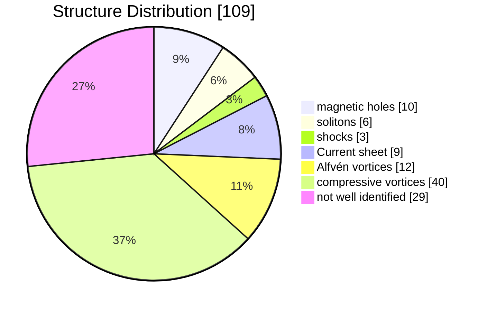

---
{"dg-publish":true,"permalink":"/_Documents/2 Interplanetary structures/","noteIcon":"default","created":"2025-10-23T14:37:00.814+08:00","updated":"2025-11-04T12:13:05.947+08:00"}
---

# 1 Compressive Coherent Structures at Ion Scales in The Slow Solar Wind (have read)   
Perrone, D., Alexandrova, O., Mangeney, A., Maksimovic, M., Lacombe, C., Rakoto, V., Kasper, J. C., & Jovanovic, D. (2016). Compressive coherent structures at ion scales in the slow solar wind. _The Astrophysical Journal_, 826(2), 196. [https://doi.org/10.3847/0004-637X/826/2/196](https://doi.org/10.3847/0004-637X/826/2/196)
## 1.1 主要内容  
### 1.1.1 简介
> [!摘要]
> $\quad$ 本研究旨在探究慢太阳风流中接近离子尺度的磁场波动，我们在此观测到了磁压缩的显著增加。研究发现，这些压缩性波动的本质特征是相干结构。尽管先前的研究表明，电流片是离子尺度间歇性的主要成因，但我们的研究首次揭示，在慢太阳风环境下，多种多样的相干结构共同导致了质子尺度的间歇性，而电流片并非其中最普遍的类型。  
> $\quad$ 具体来说，我们发现了具有压缩性 ($\delta b_\parallel \gg \delta b_\perp$) 和线性极化的结构，它们表现为磁洞、磁孤子和激波等形式。此外，还识别出一些阿尔芬结构 ($\delta b_\perp \gg \delta b_\parallel$)，它们以电流片和类似涡旋的结构存在。部分涡旋的 $\delta b_\parallel \gg \delta b_\perp$，类似于阿尔芬涡旋，但大多数结构的特征是 $\delta b_\perp \gtrsim \delta b_\parallel$。  
> $\quad$ 多亏了 Cluster 的多点测量数据，我们得以对大约 100 个结构进行分析，并确定了它们的法向、传播速度以及沿法向的空间尺度。值得注意的是，无论结构类型如何，其法向总是垂直于局部磁场，这意味着 $k_\perp \gg k_\parallel$。我们发现，这些研究结构的空间尺度约为质子回旋半径的 2 到 8 倍。其中大部分结构仅随太阳风对流，但也有 25%的结构在等离子体参考系中独立传播。最后，我们讨论了对这些观测到的结构的可能解释，以及它们与等离子体加热之间的潜在联系。  
> 

电流片和阿尔芬涡旋是一种 $\delta b_{\perp}\gg \delta b_{||}$ 的相干结构，而磁孤子和磁洞是 $\delta b_{\perp} \ll \delta b_{||}$ 的强压缩结构。这些事件的特征尺度在 5 秒到数十秒之间（对应于 10 个到数十个质子惯性尺度的厚度）。  

通过对磁场扰动的小波变换滤波，发现，在所分析的时间区间内（约 2 小时内约 600 次持续数秒的事件），约 40%的时间段被不同性质的相干结构所覆盖。在这些结构中，研究观察到了线性极化的压缩事件，如磁洞、孤子或激波结构；还有线性极化的阿尔芬事件（即具有主导横向波动 $\delta b_{\perp}\gg \delta b_{||}$ 的事件），如电流片，以及椭圆极化的阿尔芬事件：其外观类似于磁涡旋。利用 Cluster 卫星系统，研究者能够根据这些结构法线的方向以及在等离子体坐标系中的传播情况，对其中的 109 个结构进行描述。  
### 1.1.2 基本数据和小波变换
> [!tip] Overview of solar wind data for the time interval 00:00-03:00 UT on 2002 February 19 th from Cluster
> 平均风速 $360 km/s$，平均磁场 $9nT$
>   
> From top to bottom: magnitude of V (a) and B (b), latitude (θ, purple dots) and azimuth (f, green dots) angles of B (c) and $θ_{BV}$ (d); proton (blue dots) and electron (red dots) density (e), temperature (f) and plasma beta (g). Characteristic lengths for protons $L_p$ (h) and electrons $L_e$ (i): Lamour radii $ρ_i$ (dark lines) and inertial range $λ_i=\frac{c}{\omega_{pi}}$ (light lines), with i = p, e. Logarithmic contour plots of LIM(Local Intermittency Measure), I(τ, t) (see text), for parallel (l) and perpendicular (m) magnetic field fluctuations. Vertical dashed lines denote the time interval 00:12–02:36 UT used in the present analysis.

对磁场做莫雷小波变换，$\tau$ 是选取的时间尺度：
$$
\mathcal{W}_{i}(\tau, t)=\sum_{m=0}^{N-1} B_{i}\left(t_{m}\right) \psi^{*}\left[\left(t_{m}-t\right) / \tau\right]
,\quad
i = x,y,z
$$
$$
\psi(u)=2^{1 / 2} \pi^{-1 / 4} \cos \left(\omega_{0} u\right) \exp \left(-u^{2} / 2\right),\quad 
\omega_0 = 6
$$
压缩波动可近似为磁场强度的变化所导致的，因此相应的能量为：  
$$
\mathcal{W}_{\|}^{2}(\tau, t)=\mathcal{W}_{|B|}^{2}(\tau, t) .
$$
波动的总能量写作
$$
\mathcal{W}_{B}^{2}(\tau, t)=\sum_{i} \mathcal{W}_{i}^{2}(\tau, t), \quad i=x, y, z,
$$
定义阿尔芬扰动的能量（垂直于平均磁场）：
$$
\mathcal{W}_{\perp}^{2}(\tau, t)=\mathcal{W}_{B}^{2}(\tau, t)-\mathcal{W}_{\|}^{2}(\tau, t) .
$$
归一化得到 LIM (Local Intermittency Measure，图 l, m)：
$$
I_{\|, \perp}(\tau, t)
=\frac{\left|\mathcal{W}_{\|, \perp}(\tau, t)\right|^{2}}
{\left\langle \left| \mathcal{W}_{\|, \perp}(\tau,t)\right|^{2}\right\rangle_{t}},
$$
观察到磁能在时间上的非均匀分布，伴随着覆盖一系列尺度的局部能量事件的出现：这是间歇性相干结构的固有特性。
### 1.1.3 间歇性事件的识别
在特定的尺度范围（本文为 $\tau \in [0.5, 10]s$）内，磁场的波动可以通过基于小波变换的带通滤波器来定义：  
$$
\delta b_{i}(t)=\frac{\delta j \delta t^{1 / 2}}{C_{\delta} \psi_{0}(0)} \sum_{j=j_{1}}^{j_{2}} \frac{\tilde{\mathcal{W}}_{i}\left(\tau_{j}, t\right)}{\tau_{j}^{1 / 2}}
,\quad
i = x,y,z,\perp,\| 
$$
此处 $j$ 是尺度 $\tau$ 的索引，$\delta j$ 是尺度的常数步长，$\psi_0(0)=\pi^{1/4},~ C_\delta =0.776$（可见[[_Documents/docs/3.2 A Practical Guide to Wavelet Analysis.pdf|小波教程_en]]），采取 $\tau(j_1)=0.5s,~\tau(j_2)=10s$.  

上图(b)的非高斯分布尾部特征表明，湍流存在某种间歇性或不均匀性。图(c)的磁波动能量的包络线由蓝色实线表示，是包裹振荡信号极值的平滑曲线，垂直的红色实线表示高斯函数拟合结果的三个标准差的位置($\delta b_{\|}^2 = 3.9 \times 10^{-2} \text{nT}^2$)，这一范围包含了高斯函数贡献的 99.7%，所有超出此限值的事件都会贡献于 PDF 的非高斯部分。该数值将被用作筛选非高斯压缩间断事件的阈值。  

将某一事件的宽度 Δτ′ 定义为包络线中两个最小值之间的时间范围，该范围包含超过阈值的能量的最大值。事件的特征时间尺度 Δτ 可以定义为半峰值宽度（即图中黑色虚线的交点）。在所研究的整个时间范围内，共记录到约 600 个事件（$\Delta \tau \in [0.25, 7]~ \text s,~\Delta \tau' \in [0.75, 7.5]~ \text s$ 。对这些事件进行最小方差分析，可以识别出 6 个 families。

包括：  

| Strongly Compressive Structures (the maximal variation is $\delta b_z$, evaluated by $\xi_{\parallel}= \sqrt{\frac{{\max(\delta b_z^2)}}{max(\delta b_x^2 +\delta b_y^2)}}$)                                                                                                                                                                                                                                                                                                   | Alfvénic Structures ($\delta b_{\perp}>\delta b_{\parallel}$)                                                                                                                                                                                                                                                                                                                                                                                                                                                                                                                                                                                                                    |
| ------------------------------------------------------------------------------------------------------------------------------------------------------------------------------------------------------------------------------------------------------------------------------------------------------------------------------------------------------------------------------------------------------------------------------------------------------------------------------ | -------------------------------------------------------------------------------------------------------------------------------------------------------------------------------------------------------------------------------------------------------------------------------------------------------------------------------------------------------------------------------------------------------------------------------------------------------------------------------------------------------------------------------------------------------------------------------------------------------------------------------------------------------------------------------- |
| Soliton  ：the ion temperature is almost isotropic ($T_\perp / T_{\parallel} \approx 1.1$, $C_M<1$)   $\xi_{\parallel}=1.6$                                                                                                                                                                                                                                                                  | Current sheet  ：$T_\perp / T_{\parallel} \approx 0.6$                                                                                                                                                                                                                                                                                                                                                                                                                                                                                                                                               |
| magnetic hole   ：   high values of temperature anisotropy ($T_\perp / T_{\|} \approx 2$， $C_M>1$) and plasma beta. "mirror mode structures". near-zero spreading speed.    
chain
$\xi_{\parallel}=2.1$     
solitary
$\xi_{\parallel}=1.8$   | Vortex ：characterized by a local increase of the background magnetic field, $\nabla_{\perp}\gg \nabla_{\parallel}(k_\perp \gg k_{\parallel})$. isotropic.    
solitary Alfvén vortex (similar to what is observed for dipolar Alfvén vortices in the Earth’s magnetosheath (Alexandrova et al. 2006) and compatible with a cylindrical structure)
$\xi_{\parallel}=0.16$        
Alfvén vortex-like
$\xi_{\parallel}=0.33$          |
| shock: $T_\perp / T_{\parallel} \approx 2.1$, Mach number > 1(compatible with the fast magnetosonic shock wave)    $\xi_{\parallel}=0.95$                                                                                                                                                                                                                                                   | compressive vortex-like： $\xi_{\parallel} \in [0.35, 1.1]$      $\xi_{\parallel} \approx 0.5$    they can propagate in the flow or can be convected by the wind.                                                                                                                                                                                                                                                                                                                                                                                                                                  |
| A careful inspection of the 600 structures shows that   usually magnetic holes appear in the plasma as a chain of compressive structures, while solitons are observed as isolated structures.                                                                                                                                                                                                                                          |                                                                                                                                                                                                                                                                                                                                                                                                                                                                                                                                                                                                                                                                                  |

在上图的图(b)中，$x,y,z$ 方向与 GSE 坐标不同。定义 $\Delta\tau'$（黑色虚线）范围内的局部平均磁场 $\boldsymbol{b_0}$，以及局部平均流速 $\boldsymbol{v_0}$，则 $\boldsymbol{e_z} = \boldsymbol{\hat b_0}$，$\boldsymbol {{e_x}} = \boldsymbol{\hat b_0} \times \boldsymbol{\hat{v_0}}$，$\boldsymbol{e_y}$ 满足右手系定义。  

电流密度通过 curlometer technique (Dunlop et al. 1988, 2002) 计算得到，对于 solitons、holes 和 shock，$\boldsymbol{J}$ 接近垂直于局地磁场 $\boldsymbol{b_0}$，尤其是 solitons，几乎完全垂直。而对于 sheet、Vortex 和 compressive vortex-like structrues，则几乎是 $\boldsymbol{J} \parallel  \boldsymbol{b_0}$。  

绝大多数观测到的结构是 compressive vortex-like structrues，基本满足 $\delta \boldsymbol b_{max} \perp \boldsymbol{b_0},\ \delta \boldsymbol b_{intermediate} \parallel \boldsymbol{b_0}$，因此有稍强的压缩 $\xi_{\parallel} \approx 0.5$，

这些结构的法向 $\boldsymbol{n}$ 由 timing method (section 4.2.1) 得到，magnetic holes 严格成立 $\boldsymbol{n} \perp \boldsymbol{b_0}$，其他结构也基本满足垂直的关系。  

文章指出其他几个注意点：  
> The normal to the structures was determined assuming that the structure is locally planar. However, this front seems to be perturbed or finite, especially in case of the magnetic holes (one can see that the different satellites observe different amplitudes). Such variation in amplitude cannot be explained by an infifinite plane (in that case, all satellites would see the same amplitude in each point of the plane). Therefore, the structure is not perfectly planar.  
> 
> Almost all the magnetic holes are observed under mirror unstable plasma conditions (mirror parameter $C_M=\left(\frac{\beta_{\perp}}{\beta_{\|}}-1\right)\left(\beta_{\perp}+1\right)>1,\ \beta_{\perp,\|}=\frac{2 \mu_{0} P_{\perp,\|}}{B^{2}}$)  
> 
> In most cases, the propagation velocities for the solitons are different from zero and are of the order of the velocity of the fast mode and/or proton thermal speed. Therefore, the observed magnetic solitons cannot be explained by the mirror instability. （Their (Sloitons') existence as traveling waves means they are sustained by a balance between the medium's non-linear effects (which cause waveform steepening) and its dispersive effects (which cause spreading). On the contrast, Even though the nonlinear evolution of the mirror instability can lead to stable structures like magnetic holes, the classical or linear mirror mode itself is defined by its near-zero phase speed.）

在 109 个结构子集中，每种结构的占比如下：

因为与相邻的已确定的间歇性事件的相互作用，$27\%$ 的结构无法确定。

### 1.1.4 统计分析  
#### 最小方差分析（600 事件）  
计算了每个结构(范围 $\Delta \tau'$)的协方差矩阵，确定 max, int, min 三个特征值的比值和特征值方向(与局地磁场的夹角)的分布。表明 $\theta_max>65^\circ$ 居多，即大部分是 Alfvén 结构。  
#### Timing Method  
使用 timing method [Schwartz, 1998] 和四颗卫星确定结构的法向 $\vec{n}$ 和法向速度 $\mathcal{V}$：  
$$
\vec{D_{ij}} \cdot \frac{\vec{n}}{\mathcal{V}} = \Delta t_{ij} ,\quad  i,j \in \{1,2,3,4\}; ~i\neq j
$$
其中 $\vec{D_{ij}} = \vec{D_j} - \vec{D_i}$ 是两颗卫星之间的位矢，$\Delta t_{ij} = t_j  - t_i$ 是卫星测量时间间隔，$|D|\approx 0.1 \text{km}$，而 $\Delta t_{ij}$ 由互相关函数(the cross-correlation function)的最大值计算确定：  
$$
\max\mathcal{R}_{i j}(\Delta t)=\frac{\left\langle\delta \boldsymbol{B}_{i}(t) \cdot \delta \boldsymbol{B}_{j}(t+\Delta t)\right\rangle}{\sqrt{\langle\delta B_{i}^{2}\rangle\langle\delta B_{j}^{2}\rangle}} 
$$
$\Delta t_{ij}$ 的误差根据 $R_{i j}(\Delta t)$ 的 Taylor 展开得到：  
$$
d \Delta t_{i j}=\sqrt{\frac{2}{\mathcal{R}_{i j}^{\prime \prime}\left(\Delta t_{i j}\right)} \frac{\Delta B}{B}}
$$
${R}_{i j}^{\prime \prime}$ 表示二阶导数。结果需满足 $\Delta t_{i j}=\Delta t_{i k}+\Delta t_{k j}, \quad \Delta t_{i j}=-\Delta t_{j i}$ (已假设事件为局部平面结构且匀速传播)，否则卫星观测到的可能不是同一事件。约定 $\vec{D_{ij}} \cdot \frac{\vec{n}}{\mathcal{V}} = \Delta t_{ij}$ 给出的斜率 $\mathcal{V}$ 不会偏差过大。最终从 600 事件中选得满足条件的事件 109 个，这些结构能够较为准确的得到 $\vec{ n}$ 和 $\mathcal{V}$。  

对该子集的统计分析表明，$\theta_{nB}$ ～ $90^\circ$，即所有相干结构都有波矢各向异性 $k_\perp \gg k_\parallel$。定义两个空间尺度：  
$$
\Delta r=\mathcal{V} \Delta \tau \quad \text { and } \quad \Delta r^{\prime}=\mathcal{V} \Delta \tau^{\prime}
$$
并计算其和质子拉莫半径 $\rho_p$ 比值的分布，  

#### 在 Plasma Frame 下的速度  
可以计算结构在等离子体参考系中的速度和误差：  
$$
\mathcal{V}_0 = \mathcal{V} - \vec{v}_{sw} \cdot \vec{n}, \quad d \mathcal{V}_{0}=d \mathcal{V}+d v_{\mathrm{sw}} \cos \theta_{n V}+v_{\mathrm{sw}} \sin \theta_{n V} d \theta_{n V}
$$
$\vec v_{sw}$ 是 solar wind 的局地平均速度。
  
可见大部分结构(约 $75\%$)是随着太阳风对流的。右图中，三个用于归一化的分母是：the upstream speed for the fast modes $V_F$ (black histogram), for the Alfvén $V_A$ (red dashed line), and the proton thermal speed $V_{th}$ (blue dash-dot line). 
### 1.1.5 Conclusions  

## 1.2 链接  
[[_Documents/docs/2.1 Perrone et al_2016_COMPRESSIVE COHERENT STRUCTURES AT ION SCALES IN THE SLOW SOLAR WIND.pdf|Perrone et al_2016_COMPRESSIVE COHERENT STRUCTURES AT ION SCALES IN THE SLOW SOLAR WIND]]
## 1.3 补充
文章阅读中遇到的生词以及**一些关键概念**在在: [[_Documents/words/words - Compressive Coherent Structures at Ion Scales in The Slow Solar Wind\|words - Compressive Coherent Structures at Ion Scales in The Slow Solar Wind]]

# 2 Coherent Structures at Ion Scales in Fast Solar Wind: Cluster Observations  
Perrone, D., Alexandrava, O., Roberts, O. W., Lion, S., Lacombe, C., Walsh, A., Maksimovic, M., & Zouganelis, I. (2017). Coherent structures at ion scales in fast solar wind: Cluster observations. _The Astrophysical Journal_ , 849(1), 49. https://doi.org/10.3847/1538-4357/aa9022
## 2.1 主要内容  
## 2.2 链接
本地 [[_Documents/docs/2.2 Perrone et al_2017_Coherent Structures at Ion Scales in Fast Solar Wind.pdf|2.3 Perrone et al_2017_Coherent Structures at Ion Scales in Fast Solar Wind]]
## 2.3 补充

# 3 Magnetospheric multiscale observation of kinetic signatures in the Alfvén vortex  
Wang, T., Alexandrova, O., Perrone, D., Dunlop, M., Dong, X., Bingham, R., Khotyaintsev, Y. V., Russell, C. T., Giles, B. L., Torbert, R. B., Ergun, R. E., & Burch, J. L. (2019). Magnetospheric multiscale observation of kinetic signatures in the Alfvén vortex. _The Astrophysical Journal Letters,871_(2), L 22. [https://doi.org/10.3847/2041-8213/aafe0d](https://doi.org/10.3847/2041-8213/aafe0d)  
# 4 Soliton approach to magnetic holes
Baumgärtel, K. (1999), Soliton approach to magnetic holes, _J. Geophys. Res._, 104(A12), 28295–28308, doi:[10.1029/1999JA900393](https://doi.org/10.1029/1999JA900393 "Link to external resource: 10.1029/1999JA900393").
# 5 Magnetic Holes in the Solar Wind  
Turner, J. M., L. F. Burlaga, N. F. Ness, and J. F. Lemaire (1977), Magnetic holes in the solar wind, _J. Geophys. Res._, 82(13), 1921–1924, doi:[10.1029/JA082i013p01921](https://doi.org/10.1029/JA082i013p01921 "Link to external resource: 10.1029/JA082i013p01921").

# 6 Small-scale solitary wave pulses observedby the Ulysses magnetic field experiment
Rees, A., A. Balogh, and T. S. Horbury (2006), Small-scale solitary wave pulses observed by the Ulysses magnetic field experiment, _J. Geophys. Res._, 111, A10106, doi:[10.1029/2005JA011555](https://doi.org/10.1029/2005JA011555 "Link to external resource: 10.1029/2005JA011555").
# 7 Properties of magnetosheath mirror modes observed by Cluster and their response to changes in plasma parameters
Soucek, J., E. Lucek, and I. Dandouras (2008), Properties of magnetosheath mirror modes observed by Cluster and their response to changes in plasma parameters, _J. Geophys. Res._, 113, A 04203, doi:[10.1029/2007JA012649](https://doi.org/10.1029/2007JA012649 "Link to external resource: 10.1029/2007 JA 012649").  

# 8 Fluid theory of coherent magnetic vortices in high-space plasmas  
Jovanović, D.,  O. Alexandrova, M. Maksimović, and M. Belić,  (2020). Fluid theory of coherent magnetic vortices in high-β. _space plasmas_. arXiv. [https://doi.org/10.48550/arXiv.1705.02913v5](https://doi.org/10.48550/arXiv.1705.02913v5)
